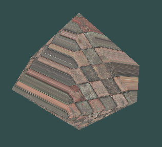

# Playing around with Dodecahedrons in OpenGL
### - By Anmol Agarwal
( I have used 2 fragment shaders : one using textures and other one using color interpolation)

## Running
```bash
$ ./run.sh
Enter corresponding choice to see the SOLID ON THE SCREEN
Enter 1 for Elonagated Square Dipyramid
Enter 2 for Hexagonal dipyramid
Enter 3 for Undecagonal pyramid

> [ENTER APPROPRIATE CHOICE HERE]

Do you want texture or not ?
Enter 1 for COLOR Interpolation shade on figures
Enter 2 for wall texture on solids

> [ENTER APPROPRIATE CHOICE HERE]
```

## Modelling
All vertex coordinates for the different geometrical figures are calculated inside of code `ball.cpp`.
The 3 chosen figures are:-
* Elongated Square Dipyramid


* Hexagonal Dipyramid



* Undecagonal Pyramid


#### All code files (including shaders) can be found [here](./source)

## Controls
The following keys are used for movement:-
NOTE: The axis directions I have mentioned below is in a configuration where the direction where camera is focussed is the -ve z axis (considering camera to be at origin)

### Camera specific
- <kbd>W</kbd>: To move the camera in a direction normal to the plane of the screen into the screen (along -ve z axis)
- <kbd>S</kbd>: To move the camera in a direction normal to the plane of the screen out of the the screen (along +ve z axis)
- <kbd>A</kbd>: To move the camera in a sideways direction (left side) in the global space (along -ve x-axis)
- <kbd>D</kbd>: To move the camera in a sideways direction (right side) in the global space (along +ve x-axis)
- <kbd>R</kbd>: To move the camera in a vertical direction (UP) in the global space (along +ve y-axis)
- <kbd>F</kbd>: To move the camera in a vertical direction (DOWN) in the global space (along -ve y-axis)

### Geometrical figure specific
- <kbd>W</kbd>: To move the geometrical figure in a direction normal to the plane of the screen into the screen (along -ve z axis)
- <kbd>S</kbd>: To move the geometrical figure in a direction normal to the plane of the screen out of the the screen (along +ve z axis)
- <kbd>A</kbd>: To move the geometrical figure in a sideways direction (left side) in the global space (along -ve x-axis)
- <kbd>D</kbd>: To move the geometrical figure in a sideways direction (right side) in the global space (along +ve x-axis)
- <kbd>R</kbd>: To move the geometrical figure in a vertical direction (UP) in the global space (along +ve y-axis)
- <kbd>F</kbd>: To move the geometrical figure in a vertical direction (DOWN) in the global space (along -ve y-axis)

## Rotation and orientation related
- <kbd>Z</kbd>: Starts rotating the geometric figure about an axis passing through a fixed point in the figure
- <kbd>X</kbd>: STOPS the rotation which was started by pressing 'Z'
- <kbd>B</kbd>: Focusses the camera on the geometric figure
- <kbd>N</kbd>:  Focusses the camera on the geometric figure and then starts making the object spin around the object
- <kbd>M</kbd>: Stops the spinning of the camera which was started by pressing 'N'
- 
- <kbd>1</kbd>: Makes the camera orient itself to an orientation A relative to the figure and focusses the camera on the figure
- <kbd>2</kbd>: Makes the camera orient itself to an orientation B relative to the figure and focusses the camera on the figure
- <kbd>3</kbd>: Makes the camera orient itself to an orientation C relative to the figure and focusses the camera on the figure


## Some implementation details and other information
* WHile implementing the spinning of the camera around the object, I had two possible ways of spinning:
    1. Spin the camera around the object as we, spin around the axis passing through the center of the Earth, at the latitude at which we are. In this case, the center of rotation does not coincide with the center of the Earth. 
    2. Spin the camera around the object in a way similar to the way the moon revolves around the Earth (center of revolution would coincide wih Earth)
    I went ahead and implemened the 1st option.
* As per current implementation, any ongoing rotations of the camera about the geometric figure is halted if either the camera or the geometric figure is attempted to be moved. This can be changed by changing the value of variables `stop_spinning_on_object_movement` and `stop_spinning_on_camera_movement` at the top of `main.cpp`.
